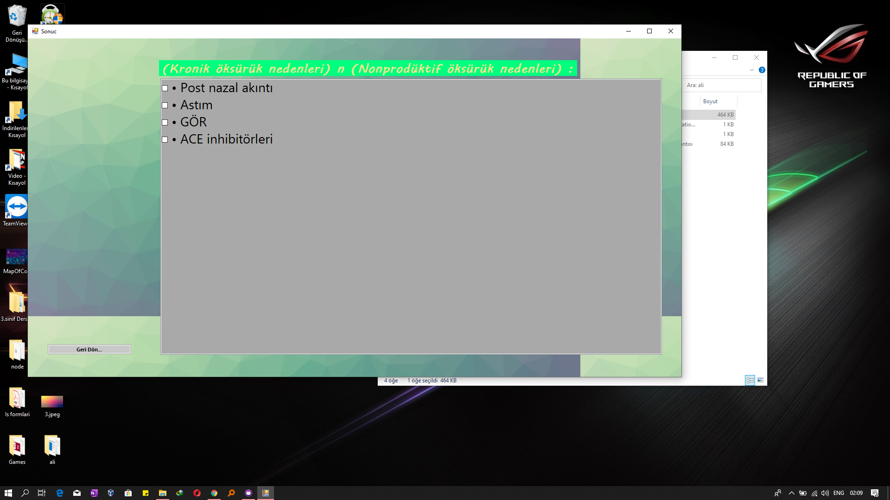
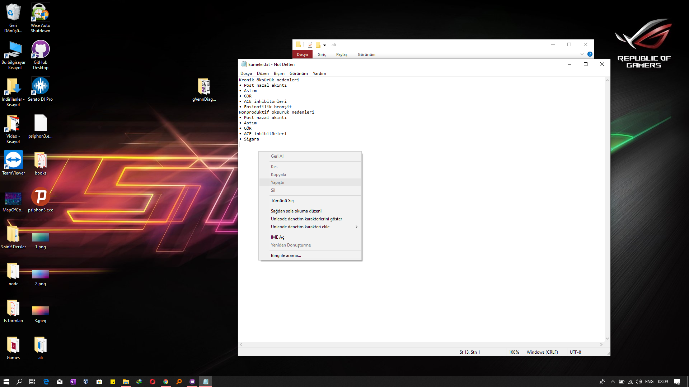

# Categorizer
its a program for m y firend mert which u can categorize some sets and elements whith graphics
if you want to install 
download setup.rar uzip .. next next next.. 
you can also add kayit.txt from setup.rar to installation directory for example data

compare some 2 or more sets : 

delete or change set name or elements in ui

input your data whith copy paste from kayit.text file 

save your staff

ScreenShots:

